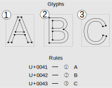
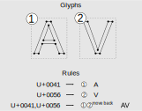
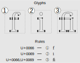
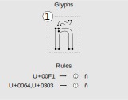
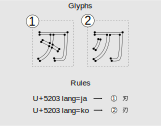
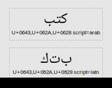

# About Text Rendering in MapLibre

This document describes how text rendering works in MapLibre. It has two parts: First, some high level concepts of a general purpose text rendering system are introduced. Browsers, word processors, operating systems and other applications are examples which probably operate like this. Second, we have a closer look at how MapLibre renders text. MapLibre has different constraints and requirements than most general purpose text rendering systems and has therefore its own set of limitations which we shall discuss.

## General Purpose Text Rendering Systems

In the following section we shall outline how a general purpose text rendering system such as a web browser, word processor, or operating system works.

At a high level, text rendering can be divided in three stages:

* Segmentation
* Shaping
* Rasterization

Let us start with some basic text rendering definitions which will help us to better understand the different stages.

#### Unicode codepoint

A Unicode codepoint is a number which represents a letter, a digit, an exclamation mark or other punctuation, or many other things that can appear in text. Unicode codepoints are usually prefixed with “U+”, for example U+0041 is the letter "A" of the Latin alphabet (0x41 is 65 in decimal, which lines up with the ASCII definition of "A"). Text is stored as Unicode codepoints.

#### Glyph

A glyph is the geometrical representation of the outline of a letter, part of a letter, or any other visual element that is contained in a font. Glyphs are usually stored as vector geometries in the form of Bezier curves.

#### Font File

A font file contains glyphs and rules. The glyphs hold the geometries. The rules describe how Unicode codepoints map to glyphs. While a simple font might have a one-to-one mapping between codepoints and glyphs, more interesting things can happen as we will show later with some examples.

#### Positioned Glyph

A positioned glyph explains where to put a glyph from a font file relative to the last glyph which was positioned. It contains 5 numbers:

* Glyph id: The id of the glyph in the font file
* Advance X: How wide the glyph is
* Advance Y: How high the glyph is
* Offset X: How much the glyph should be moved horizontally relative to the last positioned glyph
* Offset Y: How much the glyph should be move vertically relative to the last positioned glyph

#### Language

The language is just the language in which a text is written in. Examples: German, French, Hindi.

#### Script

The script is the writing system a text is written in. Examples: Latin, Greek, Devanagari.

Note that a language can be written using one or more scripts, and a script can be used by one or more languages. Examples:

* The English language is written in the Latin script.
* The Japanese language is written in 3 scripts: Kanji, Hiragana, and Katakana.
* The Devanagari script is used in the languages Hindi, Marathi, Sanskrit, and many more.

#### Direction

The text direction is the direction in which text is written with the two most common directions being left-to-right (e.g. Latin, Greek), and right-to-left (e.g. Arabic, Hebrew). 

The codepoints in a string always have logical order, meaning that the first letter of a word comes before the second letter of a word.

#### Variation Settings

A font can support multiple variation settings. One example is the font weight, i.e., how thick letters appear.

With this overview of definitions, let us now have a closer look at what shaping is (the second stage), and then we will look into segmentation (the first stage) and rasterization (the third stage).

### Shaping

Text shaping is the process of turning an input string into a series of positioned glyphs. For this, a shaping engine reads the rules of a font file and applies them to the input string. For a given font and input string, shaping requires knowledge of the following points:

* Language
* Script
* Direction
* Variation Settings

Shaping only works if the above properties are the same across the entire input string.

To get an intuition for what shaping means, let us look at some examples.

#### Example 1:  A One-to-One Font

The first example is a most basic font. It contains 3 glyphs and supports the 3 Unicode codepoints U+0041 (A), U+0042 (B), U+0043 (C) as input. The rules are that every codepoint maps to one and only one glyph.

<i>Font example 1: a one-to-one font. The font has 3 glyphs and they map to 3 different input codepoints.</i>

#### Example 2: Kerning

Our second font contains two glyphs and supports two input Unicode codepoints: U+0041 (A) and U+0056 (V). There is a one-to-one mapping from Unicode codepoints to glyphs in the font, but something special happens if "A" is followed by "V" – the "V" moves a bit back and vertically overlaps with the "A". This is called kerning.

<i>Font example 2: Kerning. If an "A" is followed by a "V", the "V" gets shifted back a little bit.</i>

#### Example 3: Ligature

In the third example, the font file contains three glyphs but only supports two input Unicode codepoints: U+0066 (f) and U+0069 (i). In this font, there is no one-to-one mapping from Unicode codepoint to glyph id. That is because something special happens when the “f” is followed by an “i” – the "f" eats the dot of the "i" – and the font rules say that a special glyph should be used if the input is [U+0066 (f), U+0069 (i)]. This is called a ligature. 

<i>Font example 3: Ligature. If an "f" is followed by an "i", a special glyph should be used where the "f" seems to eat the dot of the "i".</i>

#### Example 4: ñ

In the next example, we look at a font which has only a single glyph but three Unicode codepoints map to this glyph: U+00F1 (ñ) and [U+0064 (n), U+0303 (~)]. So in this font, different Unicode codepoint combinations map to the same glyph, i.e., they give the same visual result.

<i>Font example 4: ñ. The letter "ñ" can either be stored as a single codepoint U+00F1, or as a sequence of two codepoints U+0064 which is the lowercase Latin "n" and U+0303 which is a wiggle.</i>

#### Example 5: Language Matters

Language matters in text shaping because some Unicode codepoints look different in different languages. This is in particular the case in some Chinese, Japanese, and Korean (CJK) scripts where a codepoint can represent a full word. In the example font here we use two different glyphs for Japanese and Korean for the same codepoint U+5203 which means "knife edge".

<i>Font example 5: Language matters. Some CJK codepoints have different glyphs depending on the language. Here shown is U+5203 (knife edge) which looks different in Japanese and Korean.</i>

#### Example 6: Script Matters

The script matters for text shaping because if the script is set incorrectly, shaping will not produce correct results.

Consider for example the Arabic word "كتب" [U+0643 (ك), U+062A (ت), U+0628 (ب)] which means "books". Shaped with the font NotoNaskhArabic.ttf, the result will only look correct if the script is set to Arabic:

<i>Font example 6: Script matters. Only when the script is set to Arabic, shaping will work correctly and create the appropriate ligatures for the Arab word "كتب" which means "books".</i>

#### Example 7: Direction Matters

The text direction matters for shaping. Consider this example Unicode sequence:

[U+0031 (1), U+0020 (space), U+0032 (2)]

When shaping this with text direction left-to-right, the output will be "1 2". But when shaping it with text direction right-to-left, the output will be "2 1".

### Segmentation

As we have seen above, shaping only works if the language, script, and direction are correctly set. If a text block contains multiple parts in different scripts/languages/directions, the block has to be segmented first into what are called "runs" of constant script/language/direction. Also the font and variation settings have to be constant within a run.

Segmentation starts by cutting the text block into runs of constant direction using the Unicode bidirectional algorithm. The resulting segments are called "bidi runs".

Then, the bidi runs are segmented into runs of identical script using an approach which is documented in Unicode Annex 24. The resulting segments are called "script runs".

We have now text segments of constant direction and script. Left to do is the segmentation for language, font, and variation settings. The user either specifies these or the text rendering system assumes some good default values.

Finding a font which can be used to shape a segment can be tricky. While fonts usually have a supported Unicode range, it is not guaranteed that a segment in the range can actually be shaped. If shaping fails, the input text has then to be segmented further and different fallback fonts have to be tried for shaping of the failing substring.

Finally, once all text has been segmented and successfully shaped, the text has to be broken in multiple lines. The shaping engine does not have a notion of line breaks, so this has to be handled at a higher level. Hyphenation and language-specific rules play a role for line breaking.

### Rasterization

To display the fully positioned glyphs on a screen, the vector glyph geometries have to be rasterized. Since the glyphs are stored in a vector format, they can be arbitrarily resized, rotated, and tilted before the rasterization and the text appears sharp at any scale.

Anti-aliasing is a technique used during rasterization to account for the finite size of pixels on a screen. For black text on a white background, the pixels which are partly inside and partly outside the glyph get a gray color.

## How MapLibre Renders Text

After having discussed how a general purpose text rendering system looks like, let us now take a closer look at how MapLibre renders text.

In a strongly simplified analogy, one can think of MapLibre's text rendering as a font with two rules:

* Every Unicode codepoint maps to one and only one glyph.
* Glyph offsets and advances are fixed.

These rules are similar to the ones we had in example 1 when we looked at how shaping works. In a way, this is the simplest font one can think of. Every codepoint maps to one glyph and the positioning is only dependent on the glyph. This means that there is no kerning (See example 2: AV), we don't have ligatures (example 3: fi), there is no character combination (example 4: ñ), and the language is not taken into account.

One might ask why MapLibre uses such a trivial and restrictive text rendering system? To answer this question let us get an overview of MapLibre's inner workings starting with the somewhat unique requirements of text rendering on maps.

### Requirements for Text on Maps

Text rendering in MapLibre has the following requirements:

* Text has to be resized, rotated, and tilted fluidly in response to user interactions like zoom and rotation.
* Text can have a halo, i.e., an outline color around the letters which allows to visually separate text from the varying colors behind it.
* Text should look identical on all supported platforms which includes nearly all web browsers, iOS, Android, Linux, Windows, etc.

MapLibre fulfills all three requirements by using a special way of glyph rasterization, the signed distance field method.

### Signed Distance Fields

In a general purpose text rendering system, the vector glyphs would be rasterized to exactly the size in pixels and rotation angle which is needed. MapLibre however takes a different approach. All glyphs are rasterized beforehand to what is called a Signed Distance Field (SDF).

An SDF is a small image where the pixel value represents the distance between the pixel and the nearest outline of a glyph. If a pixel happens to be inside the glyph, the value is negative and outside it is positive. Hence the name Signed Distance Field. But for text rendering, pixels inside are all treated the same, so their values are simply set to zero.

The Signed Distance Field technique has the following advantages:

* SDF glyphs can be scaled, rotated, and tilted with low computational effort in the client.
* Halos are easy to make.

And the disadvantages are:

* High computational overhead to convert vector glyphs to SDFs.
* SDF glyphs are many times larger in size than vector glyphs..
* Scaling to larger text sizes results in visual defects such as round corners.

Since it is expensive to compute SDFs from vector glyphs, the computation is done offline on a server where all SDF glyphs are pre-generated. During this process, the glyph offsets and advances are also computed and stored together with the SDF in a protobuf .pbf file. Note that the offsets and advances are derived only based on the glyph size.

### One Big Font

As mentioned earlier, MapLibre assumes that there is a one-to-one mapping from Unicode codepoint to glyph id. In fact, codepoints and glyph ids are treated as identical in MapLibre. This leads to another particularity of MapLibre: there is one big font for everything.

In general purpose text rendering, fonts are created for specific scripts. For example, there is Noto Sans Regular for Latin and Noto Sans Hebrew for Hebrew. Each of these fonts has maybe a few hundred glyphs that are indexed from 1 to n. Clients use the fonts as they encounter text segments in matching scripts.

MapLibre on the other hand would store the glyph for the Latin letter "A" (U+0041) at 0x41, i.e. at a decimal index of 65. And the glyph for the Hebrew letter Alef "א" (U+05D0) would be stored at 0x5D0, i.e. at 1488 in decimal representation.

Since there are many scripts, this approach leads to one big font which contains tens of thousands of glyphs, all of them stored as SDFs. The total size of this big font can be tens of MB and it would be impractical if clients would have to download the entire font to show a map. Therefore, the font is cut into glyph ranges with a length of 256. For example if a client needs glyph number 78, it will download range 0-255.pbf which has maybe a size of 100 kB or so.

The one-to-one mapping from Unicode codepoint to glyph id works reasonably well for scripts such as Latin and Greek. We do not get any kerning, ligatures, or substitutions, but one can argue that these features are not noticeable to many users or can be worked around in Latin and Greek. However, scripts such as Devanagari or Khmer make extensive use of ligatures and text shaping in general and MapLibre is not able to produce anything usable in these cases.

### Arabic and Hebrew

MapLibre has support for Arabic and Hebrew, both of which are right-to-left (RTL) scripts, via the use of a plugin. The plugin runs the Unicode bidirectional algorithm on input strings and creates bidi runs. The order of codepoints in right-to-left runs is simply reversed before the runs are handed over for further processing and rendering.

Arabic uses different glyphs for the same codepoint depending on where the codepoint appears within a word (initial form, medial form, final form, or isolated form). Usually, this behavior would be encoded in the rules of a font, but Unicode also has some special deprecated codepoints for the different forms of Arabic letters.

The plugin replaces Arabic codepoints with the deprecated special codepoints of the different forms.

### Chinese Japanse Korean

The languages Chinese, Japanese, and Korean (CJK) use scripts which cover tens of thousands of Unicode codepoints. In principle, the glyphs for CJK could be included in MapLibre's big pre-generated font. But the problem is that CJK codepoints used in typical city names are widely spread in Unicode.

For example, Tokio in Japanese is 東京都 [U+6771, U+4EAC, U+90FD] and each of these three letters is contained in a different 256 glyph long range. This means that we would need to download 3x 100 kB or so for just one map label.

Since the download size for pre-generated CJK glyphs is unacceptably large, MapLibre resorts to generating the SDFs for CJK directly in the client. This process relies on system fonts and is platform-dependent with different implementations on web, iOS, and Android. CJK is therefore also the area where MapLibre's promise of perfectly identical maps on all platforms breaks down. This tradeoff seems justified by the performance benefits of not having to download MBs of pre-generated glyphs.

### Discussion

Now that we have seen the different facets of text rendering in MapLibre, let us discuss its design decisions and suggest some improvements for the future.

There are two main aspects to consider: SDFs and the one-to-one mapping from codepoints to glyphs.

#### Improvements of SDFs

Let's first talk about SDFs. While SDF glyphs are indeed useful for fast scaling, rotation, and tilting one might ask the question, do maps really need glyphs that are scaled/rotated/tilted at 60 frames per second? Or would it not also be enough to only have upright text that gets resized at a much lower rate allowing the usage of regular vector glyph rasterization?

If the SDF method was replaced with regular vector glyph rasterization on the client, users could just download the smaller vector glyphs and benefit from smaller download sizes. Whether this also leads to faster map load times depends on the internet connection speed and the computational power of the end user device that does the rasterization.

Another advantage of not using SDFs is that round corners on large text could be avoided. Other map renders can show beautiful large letters with sharp corners. Large text in MapLibre on the other hand reminds more of sausages.

If one wants to keep SDFs for glyph display, one could still consider generating all of them in the client. Downloading the smaller vector glyphs and turning them into SDFs in the client might be faster than downloading the bigger pre-generated SDFs.

#### Introduce Shaping

The SDF approach has some visual deficiencies and is maybe not optimal for today's hardware, but one can argue that it works well enough. A much more problematic design decision is the one-to-one mapping between glyphs and codepoints. It means that MapLibre has no path forward for introducing support for many Indic and South-East Asian scripts such as Devanagari, Burmese, or Khmer.

Modern browsers are extremely good at text rendering and one might ask why does MapLibre not harness more of the browser's capabilities for text rendering? In principle, it should be possible that MapLibre gives the browser a string and gets back a sequence of positioned glyphs that point to system fonts. This is however not possible because of privacy concerns. If something like this was allowed, malicious websites could use system fonts for fingerprinting.

Given this limitation, MapLibre almost certainly needs to make use of a shaping engine such as Harfbuzz if it wants to support Indic and South-East Asian scripts. Also, the identity between glyph id and Unicode codepoint needs to be abandoned.

In MapLibre Native, Harfbuzz can be used directly because it is a C++ library. In MapLibre GL JS on the other hand, Harfbuzz needs to be compiled to WebAssembly leading to additional complications for users. But it should be possible to do it. The toolkit size will increase by several hundreds of kB but this penalty can be acceptable to users whose languages cannot be rendered today.

But as we have seen above in the discussion of a general purpose text rendering system, shaping alone is not sufficient. We also need segmentation.

#### Introduce Segmentation

For the shaping engine to work correctly, the input text has to be segmented and MapLibre should implement a segmentation stage which creates bidi and script runs. Fortunately, there is a library called libraqm that can do this. Like Harfbuzz, Raqm is a C++ library which can be directly compiled into MapLibre Native and would need to be shipped as WebAssembly for MapLibre GL JS.

#### Alternatives

Rather than moving MapLibre more towards a general purpose text rendering system with segmentation, shaping, and rasterization, one can also explore alternatives which hand over complexity from MapLibre to the server or the browser or operating system.

First, one could render text in unsupported scripts inside a HTML canvas or equivalent component on Android and iOS. The resulting image could then either be directly put on the map, or it could be converted to an SDF. While the SDF option would give the user more controls such as dynamic coloring, halos, and resizing, it would also be computationally much more expensive than directly putting the images on the map and might be too slow for the average end user device. This approach would also mean that text will be like little bricks that do not bend along lines.

Second, one could perform text segmentation and shaping during tile generation time and embed positioned glyphs in the vector tiles rather than bare Unicode strings. This approach would probably be as performant as the current system, it would avoid having to ship a shaping engine and segmentation stage to the end user, and the results would look identical on all platforms. The disadvantage is that clients would not be able to dynamically add text to the map without making a server call. However, one could probably still build a plugin that contains a shaping engine and segmentation stage using Harfbuzz and Raqm.

## Outlook

This document describes how MapLibre renders text, what its limitations are, and makes some suggestions for improvements in the future. It is an exciting time to work on text rendering in MapLibre because it is not perfect yet and any improvement will likely mean that millions if not billions of people get to enjoy vector maps in their native language. So it is well worth the effort...
